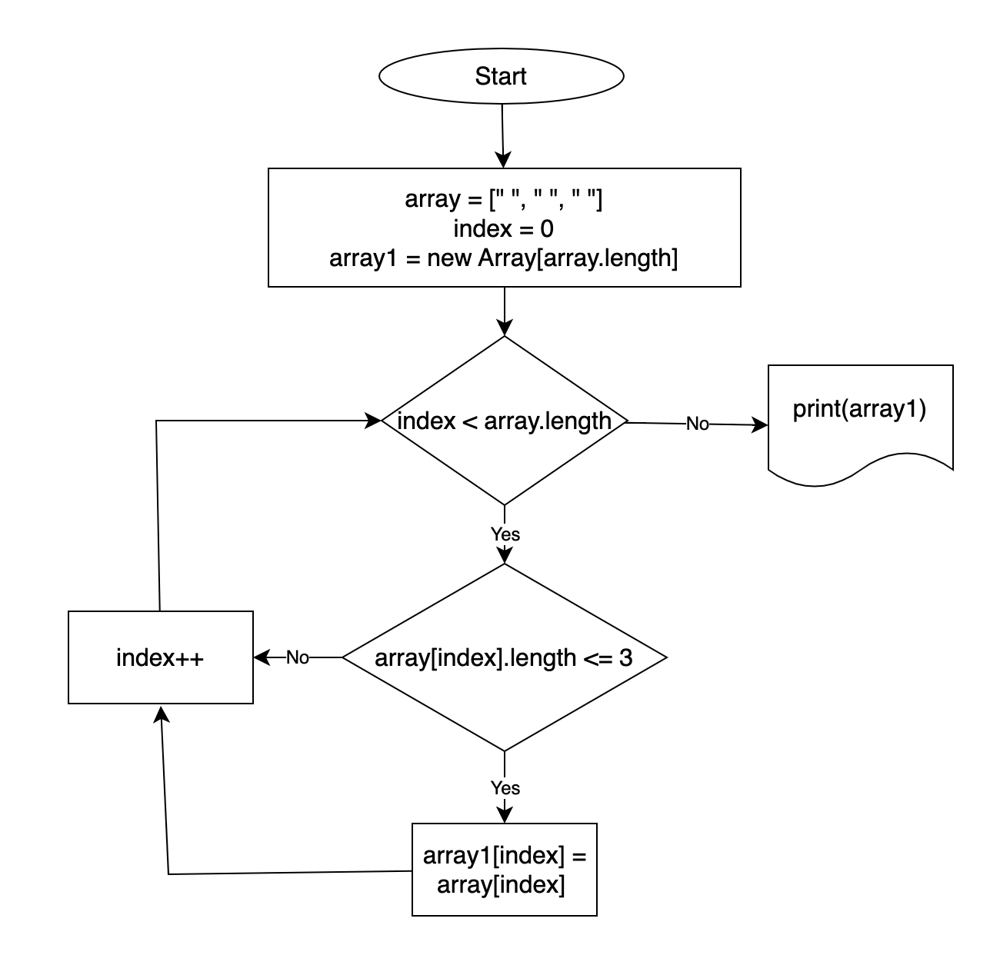

## C# итоговая контрольная

1. Создать массив с исходными данными
2. Создать новый массив с размером не больше первого
3. На каждый элемент массива делаем проверку, что бы количество символов не было больше трех
4. Если выполняется условие добавляем элемент в новый массив
5. Печатаем новый массив